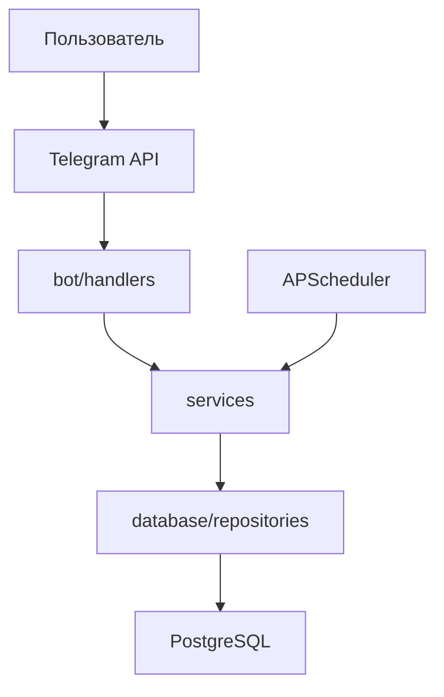

# Архитектура приложения "Nelegram-бот расписания СФУ"

## Общий принцип

Проект использует слоистую архитектуру с разделением ответственности. Каждый слой решает свою задачу и взаимодействует только с соседними слоями. Это упрощает тестирование, поддержку и масштабирование кода.

## Структура папок

telegram-schedule-bot/
├── src/
│ ├── bot/ # Слой представления (Presentation Layer)
│ │ ├── handlers/ # Обработчики команд и сообщений
│ │ │ ├── start.py # /start, /help, регистрация
│ │ │ ├── schedule.py # /schedule, /today, /week
│ │ │ ├── reminders.py # /reminder, /reminders
│ │ │ ├── notes.py # /note, /notes
│ │ │ ├── homework.py # /homework, /homeworks, /deadlines
│ │ │ └── admin.py # /upload_schedule (только для админов)
│ │ ├── keyboards/ # Клавиатуры (Reply и Inline)
│ │ │ ├── main_menu.py # Главное меню бота
│ │ │ └── inline_menus.py # Inline-кнопки для выбора
│ │ ├── middlewares/ # Промежуточные обработчики
│ │ │ ├── check_registration.py # Проверка, выбрал ли пользователь группу
│ │ │ └── check_admin.py # Проверка прав администратора
│ │ └── fsm_states/ # Состояния FSM для пошаговых диалогов
│ │ ── states.py
│ │
│ ├── services/ # Слой бизнес-логики (Business Logic Layer)
│ │ ├── schedule_service.py # Логика работы с расписанием
│ │ ├── reminder_service.py # Логика напоминаний
│ │ ├── note_service.py # Логика заметок
│ │ ├── homework_service.py # Логика домашних заданий
│ │ └── notification_service.py # Отправка массовых уведомлений
│ │
│ ├── parsers/ # Парсинг расписания
│ │ ├── excel_parser.py # Чтение и парсинг Excel-файлов СФУ
│ │ ├── zip_handler.py # Работа с ZIP-архивами
│ │ └── validators.py # Валидация данных из Excel
│ │
│ ├── database/ # Слой доступа к данным (Data Access Layer)
│ │ ├── models/ # SQLAlchemy-модели (таблицы БД)
│ │ │ ├── init.py
│ │ │ ├── user.py # Модель пользователя
│ │ │ ├── institute.py # Справочник институтов
│ │ │ ├── course.py # Справочник курсов
│ │ │ ├── group.py # Учебные группы
│ │ │ ├── schedule.py # Расписание
│ │ │ ├── reminder.py # Напоминания
│ │ │ ├── note.py # Заметки
│ │ │ └── homework.py # Домашние задания
│ │ ├── repositories/ # Функции запросов к БД
│ │ │ ├── user_repo.py
│ │ │ ├── schedule_repo.py
│ │ │ └── ...
│ │ └── connection.py # Подключение к PostgreSQL
│ │
│ ├── utils/ # Вспомогательные функции
│ │ ├── config.py # Загрузка настроек из .env и константы
│ │ ├── logger.py # Настройка логирования
│ │ └── helpers.py # Общие утилиты (форматирование времени и т.д.)
│ │
│ └── main.py # Точка входа в приложение
│
├── migrations/ # Миграции БД (Alembic)
├── tests/ # Тесты
│ ├── test_parsers/
│ ├── test_handlers/
│ └── test_services/
├── docs/ # Документация проекта
├── logs/ # Логи бота
├── data/ # Тестовые данные (sample_groups.json)
── .env.example # Пример файла с переменными окружения
├── .gitignore
├── requirements.txt
└── README.md

## Принцип взаимодействия слоёв

Поток запроса от пользователя выглядит так:
Пользователь -> Telegram API -> aiogram (bot/handlers) -> services -> database -> PostgreSQL

### Пример: Пользователь отправляет /today

1. Слой handlers (`bot/handlers/schedule.py`):
   - aiogram ловит команду `/today`
   - Middleware `check_registration` проверяет, выбрал ли пользователь группу
   - Handler извлекает `telegram_id` пользователя из сообщения
   - Вызывает функцию из слоя services: `await get_today_schedule(user_id)`
   - Получает готовые данные и форматирует их в текст
   - Отправляет ответ пользователю через Telegram API

2.*Слой services (`services/schedule_service.py`):
   - Получает `user_id`
   - Делает запрос в repository, чтобы узнать группу пользователя
   - Делает запрос в repository, чтобы получить расписание на сегодня для этой группы
   - Возвращает список пар в виде Python-объектов

3. Слой database (`database/repositories/schedule_repo.py`):
   - Выполняет SQL-запрос через SQLAlchemy: `SELECT * FROM schedule WHERE group_id = ? AND day_of_week = ?`
   - Возвращает результаты в виде объектов моделей

4. PostgreSQL:
   - Хранит данные и выполняет запрос

## Ключевые архитектурные решения

### 1. Роутеры по функциональным модулям
Handlers сгруппированы по функциям (schedule.py, reminders.py, notes.py), а не по типу событий. Это упрощает навигацию для новичков - вся логика расписания в одном файле.

### 2. FSM для пошаговых диалогов
Используем встроенный FSM из aiogram 3.x для:
- Добавления заметки (шаг 1: текст -> шаг 2: предмет -> шаг 3: сохранение)
- Добавления домашнего задания (шаг 1: описание -> шаг 2: предмет -> шаг 3: дедлайн)
- Управления напоминаниями

Состояния хранятся в памяти бота.

### 3. Middleware для проверок
Два middleware решают общие задачи:
- `check_registration`: если пользователь не выбрал группу, перенаправляем его на регистрацию
- `check_admin`: если пользователь не админ, блокируем доступ к команде `/upload_schedule`

### 4. Отдельная папка parsers
Логика парсинга расписания СФУ сложная:
- Обработка объединённых ячеек
- Извлечение данных из многострочных ячеек (предмет/преподаватель/тип/корпус/аудитория)
- Игнорирование строк "Занятия для студентов, обучающихся по программам военной подготовки"
- Обработка подгрупп (1 подгруппа, 2 подгруппа)

Эта логика вынесена в отдельную папку `parsers/`, чтобы не смешивать с бизнес-логикой.

### 5. Раздельная конфигурация
- `.env` - секреты (токен бота, пароль БД, список админов)
- `config.py` - константы (названия кнопок, время напоминаний по умолчанию, максимальное количество пар)

### 6. Логирование
Используем стандартный модуль `logging`:
- Консоль: уровень INFO для продакшена, DEBUG для разработки
- Файл `logs/bot.log`: уровень INFO, ротация по размеру (10 МБ)

### 7. Тесты
Отдельная папка `tests/` с подпапками, повторяющими структуру `src/`:
- `tests/test_parsers/` - тесты парсинга Excel
- `tests/test_handlers/` - тесты handlers (с моками)
- `tests/test_services/` - тесты бизнес-логики

### 8. Зависимости между слоями
Прямые импорты (services импортируют repositories, handlers импортируют services). Dependency Injection не используется - это упрощает код для новичков. Если проект вырастет, можно добавить DI позже.

## Диаграмма компонентов

## Масштабируемость

Архитектура позволяет легко добавлять новый функционал:
- Новая функция (например, "отслеживание прогресса") = новый handler + новый service + новая модель в БД
- Изменение формата расписания = правка только `parsers/excel_parser.py`, остальной код не трогается
- Замена БД = правка только `database/connection.py` и моделей
- Добавление нового middleware = не требует изменения handlers

## Правила именования

- Файлы: snake_case (`schedule_service.py`)
- Классы: PascalCase (`ScheduleService`, `UserModel`)
- Функции: snake_case (`get_today_schedule()`)
- Константы: UPPER_SNAKE_CASE (`DEFAULT_REMINDER_TIME`)
- Переменные: snake_case (`user_id`, `group_name`)
